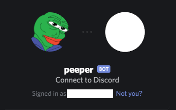
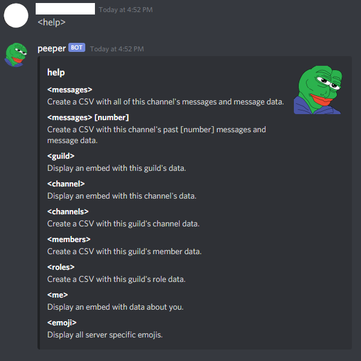

# discord-data

[](https://github.com/wlamason/discord-data/blob/master/LICENSE)

> 🤖 Discord bot to extract and backup discord data to CSV files.


## Project Objective

Democratize access to Discord's API by offering data in an end user friendly fromat (CSV). Great for back ups and analyzing discord data in your favorite spreadsheet application.

## Invite to your Discord Server

I currently run this bot under the name "peeper." Feel free to invite or self-host your own.

[](https://discord.com/api/oauth2/authorize?client_id=579534804471513100&permissions=130112&scope=bot)
[Invite link.](https://discord.com/api/oauth2/authorize?client_id=579534804471513100&permissions=130112&scope=bot)

## Commands



## Self-Hosting

[Documentation on how to create a discord bot account and receive a login token.](https://discordpy.readthedocs.io/en/latest/discord.html)

### Install

```sh
git clone https://github.com/wlamason/discord-data.git
npm install
```

### Run Locally

```sh
TOKEN=xxxxx node bot.js
```

### 🐳 Run with Docker
```sh
docker run -d -e "TOKEN=<YOUR_TOKEN_HERE>" --name discord-data --restart=always wlamason/discord-data
```

## Author

👤 **Will Lamason**

* Website: https://wlamason.github.io/
* Github: [@wlamason](https://github.com/wlamason)

## Show your support

Give a ⭐️ if this project helped you!


## 📝 License

Copyright © 2020 [Will Lamason](https://github.com/wlamason).

This project is [Apache License 2.0](https://github.com/wlamason/discord-data/blob/master/LICENSE) licensed.

***
_This README was generated with ❤️ by [readme-md-generator](https://github.com/kefranabg/readme-md-generator)_